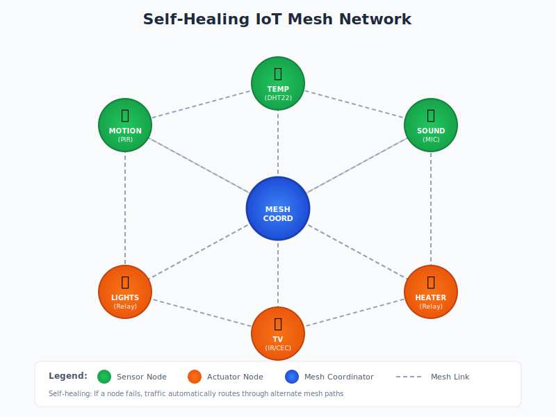

# ESP32 Mesh Swarm

A self-organizing, self-healing mesh network for ESP32 microcontrollers with distributed shared state synchronization.

## Table of Contents

- [Overview](#overview)
- [Features](#features)
- [Quick Start](#quick-start)
- [MeshSwarm Library](#meshswarm-library)
- [Architecture](#architecture)
- [Documentation](#documentation)
- [License](#license)

## Overview

This project implements a mesh network where multiple ESP32 nodes can discover each other, elect a coordinator, and share state across the entire network. When any node updates a value, all other nodes automatically sync to reflect the change.



## Features

- **Self-organizing mesh**: Nodes automatically discover and connect to each other
- **Coordinator election**: Lowest node ID automatically becomes coordinator
- **Self-healing**: Network recovers from node failures and re-elects coordinators
- **Distributed shared state**: Key-value store synchronized across all nodes
- **State watchers**: Register callbacks to react to state changes
- **Conflict resolution**: Version numbers + origin ID ensure deterministic state convergence
- **OTA updates**: Server-push firmware updates via gateway distribution
- **Telemetry**: Gateway bridges mesh telemetry to server via HTTP
- **OLED display**: Real-time status display on each node
- **Serial console**: Debug and control nodes via serial commands
- **Remote commands**: Send commands between nodes with response callbacks

## Quick Start

### 1. Clone with Submodules

```bash
git clone --recurse-submodules https://github.com/edlovesjava/iotmesh.git
cd iotmesh
```

### 2. Build and Flash

```bash
cd firmware

# Build a button node
pio run -e button

# Build an LED node
pio run -e led

# Upload to connected ESP32
pio run -e button -t upload
```

### 3. Test

1. Flash `button` to one ESP32
2. Flash `led` to another ESP32
3. Power on both nodes - they will auto-discover each other
4. Press the button - the LED on the other node will toggle

## MeshSwarm Library

All node types are built on the **MeshSwarm** library, which encapsulates mesh networking, shared state, display, and serial command functionality.

**Repository**: https://github.com/edlovesjava/MeshSwarm

### Basic Usage

```cpp
#include <MeshSwarm.h>

MeshSwarm swarm;

void setup() {
  swarm.begin();

  // Watch for state changes
  swarm.watchState("led", [](const String& key, const String& value, const String& oldValue) {
    digitalWrite(LED_PIN, value == "1" ? HIGH : LOW);
  });
}

void loop() {
  swarm.update();
}
```

### Submodule Management

MeshSwarm is included as a git submodule. See [Submodule Management](docs/submodule-management.md) for details on updating and local development.

## Architecture

### Message Types

| Type | Purpose |
|------|---------|
| `MSG_HEARTBEAT` | Periodic health check, carries role/uptime/heap |
| `MSG_STATE_SET` | Single key-value state update |
| `MSG_STATE_SYNC` | Full state dump (on join or periodic) |
| `MSG_STATE_REQ` | Request state sync from peers |
| `MSG_COMMAND` | Remote command to node |
| `MSG_COMMAND_RESPONSE` | Response to remote command |

### State Conflict Resolution

When multiple nodes update the same key:
1. Higher version number wins
2. If versions match, lower origin node ID wins (deterministic)

This ensures all nodes converge to the same state without requiring a central authority.

### Network Configuration

Default settings (modify in sketch or via build flags):

```cpp
#define MESH_PREFIX     "swarm"
#define MESH_PASSWORD   "swarmnet123"
#define MESH_PORT       5555
```

## Documentation

### Getting Started
- [Node Types](docs/node-types.md) - Available node types and hardware requirements
- [Serial Commands](docs/serial-commands.md) - Command interface reference

### Development
- [Submodule Management](docs/submodule-management.md) - Working with the MeshSwarm submodule
- [API Reference](docs/api-reference.md) - Complete MeshSwarm API documentation
- [Zones](docs/zones.md) - Multi-sensor zone configuration

### System Components
- [OTA Update System](docs/ota_update_system.md) - Over-the-air firmware updates
- [Telemetry Server](server/README.md) - Backend server setup

### Specifications & Planning (prd/)
- [IoT Mesh Roadmap](prd/iotmesh_roadmap.md) - Project roadmap
- [PlatformIO Migration](prd/platformio_migration_spec.md) - Build system documentation
- [MeshSwarm vs Zigbee](prd/meshswarm_vs_zigbee.md) - Technology comparison
- [CYD Remote Control](prd/cyd_remote_control_prd.md) - Touch remote PRD
- [Dashboard Manager](prd/dashboard_manager_spec.md) - Dashboard specification

## Server

A FastAPI backend collects telemetry from mesh nodes and provides a web dashboard.

```bash
cd server
docker-compose up -d
```

- **API Server** (port 8000): REST API for telemetry, state, and OTA management
- **Dashboard** (port 3000): React web UI for monitoring nodes
- **Database**: TimescaleDB for time-series storage

See [Server Documentation](server/README.md) for details.

## Required Libraries

Managed automatically by PlatformIO. For Arduino IDE, install via Library Manager:

- painlessMesh
- ArduinoJson
- Adafruit SSD1306
- Adafruit GFX Library
- DHT sensor library (for DHT nodes)

## License

MIT License - feel free to use and modify for your projects.
