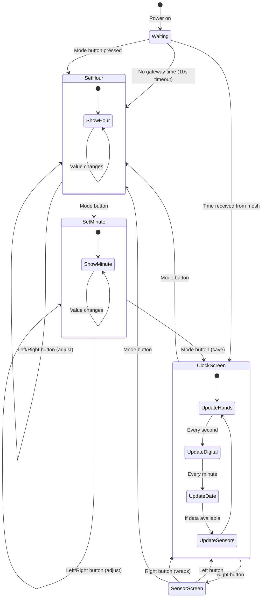

# Clock Node

A mesh-connected clock with a 1.28" round TFT display (GC9A01), showing analog/digital time, date, and sensor data from the mesh network.

## Features

- **Analog clock face** with hour, minute, and second hands
- **Digital time display** at bottom (HH:MM:SS)
- **Date display** at top (Mon DD format)
- **Temperature and humidity** from mesh DHT sensors
- **Three-button interface** for navigation and time setting
- **Sensor screen** with arc gauges for temp/humidity
- **Auto set-time mode** if no gateway time received

## Hardware

### Components

| Component | Description |
|-----------|-------------|
| ESP32 | Original dual-core dev module |
| GC9A01 TFT | 1.28" round 240x240 display |
| 3x Momentary buttons | Left, Right, Mode |

### Wiring

**Display (SPI):**
| Pin | GPIO | Description |
|-----|------|-------------|
| RST | 27 | Reset |
| DC | 25 | Data/Command |
| CS | 26 | Chip Select |
| SCL | 18 | SPI Clock |
| SDA | 23 | SPI MOSI |
| VCC | 3.3V | Power |
| GND | GND | Ground |

**Buttons (active LOW with internal pullup):**
| Button | GPIO | Function |
|--------|------|----------|
| Left | 32 | Previous screen / Decrement |
| Right | 33 | Next screen / Increment |
| Mode | 4 | Enter set time / Next field / Save |

Wire each button between GPIO and GND. Internal pullups are enabled.

## Usage

### Normal Operation

1. **Power on** - Clock shows "Waiting..." until time is set
2. **Time sync** - Automatically syncs from gateway `time` state if available
3. **View clock** - Shows analog clock with digital time at bottom
4. **View sensors** - Press right button to see sensor screen with arc gauges

### Button Controls

| Action | Normal Mode | Set Time Mode |
|--------|-------------|---------------|
| Left button | Previous screen | Decrement hour/minute |
| Right button | Next screen | Increment hour/minute |
| Mode button | Enter set time mode | Next field / Save & exit |
| Hold left/right | - | Auto-repeat adjustment |

### Setting the Time

1. **Enter set time mode:**
   - Press the Mode button, OR
   - Wait 10 seconds after power-on (auto-enters if no gateway time)

2. **Set the hour:**
   - Hour is highlighted in yellow with underline
   - Press left to decrement, right to increment
   - Hold button for fast scrolling

3. **Set the minute:**
   - Press Mode button to advance to minutes
   - Minute is highlighted in yellow with underline
   - Press left to decrement, right to increment

4. **Save and exit:**
   - Press Mode button to save time and return to clock

### Serial Commands

| Command | Description |
|---------|-------------|
| `clock` | Show current time, date, and sensor values |
| `settime HH:MM` | Manually set time (e.g., `settime 14:30`) |
| `settime HH:MM:SS` | Set time with seconds |

## Screens

### Clock Screen
- Analog clock face with hour ticks
- Hour hand (white, thick)
- Minute hand (white, medium)
- Second hand (red, thin)
- Digital time at bottom (HH:MM:SS)
- Date at top (Mon DD)

### Sensor Screen
- Title "SENSORS"
- Temperature arc gauge (left side, cyan, 200° to 340°, 0-40°C range)
- Humidity arc gauge (right side, green, 160° to 20°, 0-100% range)
- Centered numeric display: temperature above, humidity below
- Large values with units (°C and %)

### Set Time Screen
- Title "SET TIME" in yellow
- Large time display (HH:MM)
- Selected field highlighted in yellow with underline
- Instructions for button usage

## State Machine



## Implementation Details

### Button Handling

Three buttons use hardware interrupts for responsive input:

```cpp
void IRAM_ATTR onModeButtonPress() {
  if (millis() - btnModeEventTime > BTN_DEBOUNCE_MS) {
    btnModeEvent = true;
    btnModeEventTime = millis();
  }
}
```

The dedicated Mode button simplifies logic - no chording required.

### Display Updates

Efficient redraw strategy to avoid flicker:
- **Clock hands:** Only erase/redraw when angle changes
- **Digital time:** Separate functions for hours, minutes, seconds
- **Set time:** Only redraw the field being edited, with underline indicator
- **Sensor arcs:** Only update when value changes

### Selection Indicator

The selected field in set time mode uses:
- **Yellow color** for the selected digit
- **Underline** below the digit (accessibility for color blind users)

### Time Management

Time can come from multiple sources:
1. **Mesh state** - Gateway publishes `time` as Unix timestamp
2. **Manual setting** - Via Mode button or `settime` serial command
3. **NTP** - If gateway provides WiFi (not typical for mesh nodes)

Time is stored as Unix timestamp with local offset applied:
```cpp
time_t currentTime = meshTimeBase + elapsed + GMT_OFFSET_SEC + DAYLIGHT_OFFSET;
```

### Mesh Integration

Watches for sensor data from other nodes:
```cpp
swarm.watchState("temp", [](const String& key, const String& value, ...) {
  meshTemp = value;
  hasSensorData = true;
});

swarm.watchState("humid", [](const String& key, const String& value, ...) {
  meshHumid = value;
  hasSensorData = true;
});
```

## Build

```bash
# Build
pio run -e clock

# Upload
pio run -e clock --target upload

# Monitor
pio device monitor -e clock
```

## Configuration

Build-time configuration via `platformio.ini`:

```ini
build_flags =
    -DNODE_NAME=\"Clock\"
    -DMESHSWARM_ENABLE_DISPLAY=0
    -DGMT_OFFSET_SEC=-18000      ; EST = UTC-5
    -DDAYLIGHT_OFFSET=3600       ; DST = +1 hour
```

Pin overrides (if needed):
```ini
build_flags =
    -DTFT_RST=27
    -DTFT_DC=25
    -DTFT_CS=26
    -DBTN_LEFT=32
    -DBTN_RIGHT=33
    -DBTN_MODE=4
```

## Dependencies

- DIYables TFT Round library (`diyables/DIYables TFT Round`)
- MeshSwarm library
- painlessMesh
- ArduinoJson
