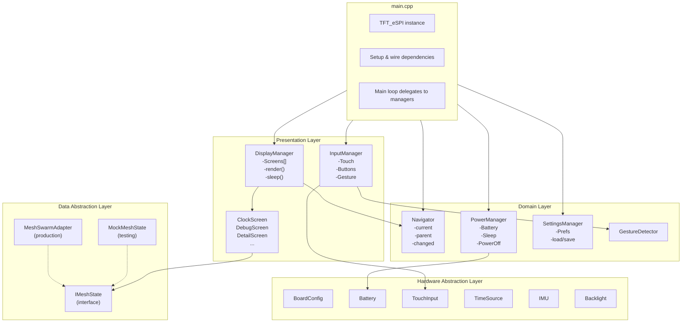
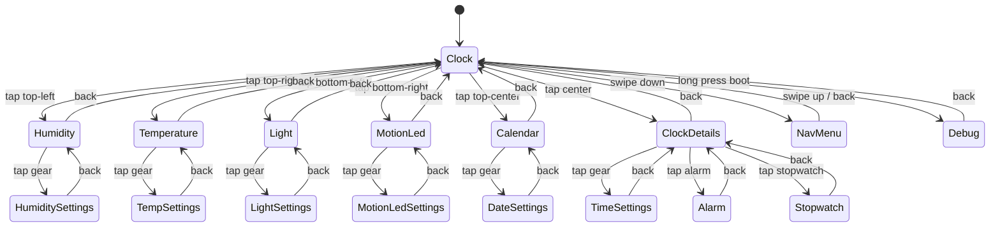
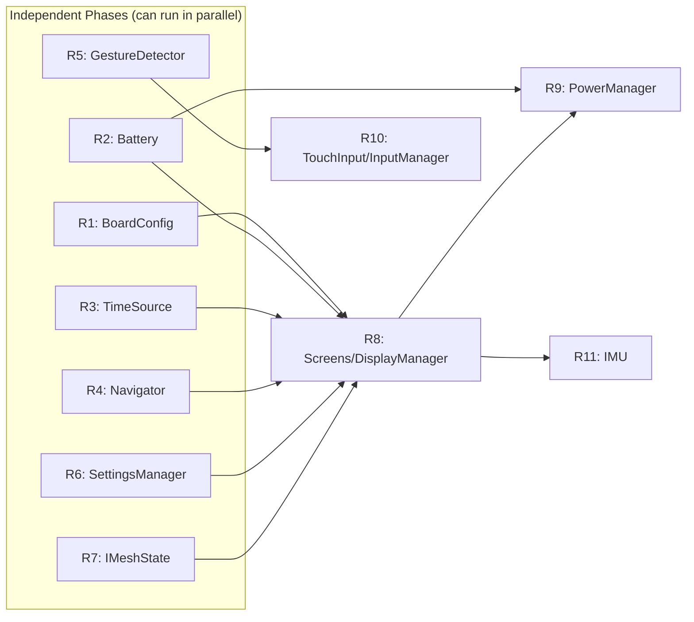

# Touch169 Code Refactoring Plan

## Current State

The `main.cpp` file (~1400 lines) is monolithic, mixing:
- Hardware pin definitions and initialization
- Power management (battery, charging, sleep)
- Display rendering (clock, corners, debug, placeholders)
- Touch input handling and gesture detection
- Navigation state machine
- Mesh state callbacks
- Serial command processing

This violates SRP (Single Responsibility Principle) and makes the code hard to test, maintain, and extend.

## Design Principles

### 1. Single Responsibility Principle (SRP)
Each class should have one reason to change:
- `Battery` changes when battery hardware/logic changes
- `Display` changes when rendering changes
- `TouchInput` changes when touch handling changes

### 2. Separation of Concerns
- **Hardware Abstraction Layer (HAL)**: Direct hardware interaction (GPIO, I2C, ADC)
- **Domain/Business Logic**: State management, navigation, timing
- **Presentation**: Screen rendering, UI layout

### 3. Dependency Injection
- Pass dependencies into classes rather than creating them internally
- Makes testing easier, allows swapping implementations

### 4. Interface Segregation
- Define abstract interfaces for hardware (allows mocking for tests)
- Screens don't need to know about I2C, just "get temperature"

---

## Proposed Architecture



**Key Ownership Rules:**
- **Navigator** owns navigation state (current screen, parent mapping, screen changed flag)
- **DisplayManager** owns rendering - calls `screens[current].render()`, manages sleep/wake for display
- **InputManager** detects gestures/buttons, fires callbacks - does NOT navigate directly
- **PowerManager** owns battery monitoring, power-off logic - delegates display sleep to DisplayManager
- **SettingsManager** owns Preferences - screens call it to load/save settings
- **main.cpp** wires everything together and owns TFT_eSPI instance

---

## Class Breakdown

### Hardware Abstraction Layer (HAL)

#### `BoardConfig` (Static/Constants)
```cpp
// Pin definitions, hardware constants
namespace BoardConfig {
  constexpr int TFT_MOSI = 7;
  constexpr int TFT_SCK = 6;
  // ... all pin definitions
  constexpr int BAT_ADC_PIN = 1;
  constexpr float BAT_VREF = 6.6;
}
```

#### `Battery`
```cpp
class Battery {
public:
  Battery(int adcPin, float vRef, float fullThreshold);

  float readVoltage();
  int getPercentage();
  ChargingState getChargingState();
  void update();  // Call periodically to track trends

private:
  int _adcPin;
  float _vRef;
  float _voltageHistory[3];
  ChargingState _state;
};
```

#### `TouchInput`
```cpp
class TouchInput {
public:
  TouchInput(int sdaPin, int sclPin, uint8_t addr);

  bool begin();
  bool read();  // Returns true if touched
  int16_t getX();
  int16_t getY();
  bool isPressed();

private:
  TouchClassCST816 _touch;
  int16_t _x, _y;
  bool _pressed;
};
```

#### `IMU` (QMI8658)
```cpp
class IMU {
public:
  IMU(int sdaPin, int sclPin, uint8_t addr);

  bool begin();
  float getTemperature();  // Board temperature
  // Future: getAccel(), getGyro()

private:
  SensorQMI8658 _imu;
};
```

#### `TimeSource` (PCF85063 RTC)
```cpp
class TimeSource {
public:
  TimeSource(int sdaPin, int sclPin);

  bool begin();
  bool hasRTC() const;  // Returns true if RTC hardware is available

  // Get current time (from RTC if available, else system millis)
  void getTime(int& hour, int& minute, int& second);
  void getDate(int& year, int& month, int& day, int& weekday);

  // Set time (syncs to RTC if available)
  void setTime(int hour, int minute, int second);
  void setDate(int year, int month, int day);

  // For alarm features (future)
  void setAlarm(int hour, int minute);
  bool isAlarmTriggered();
  void clearAlarm();

private:
  SensorPCF85063 _rtc;
  bool _hasRTC = false;

  // Fallback tracking when no RTC
  unsigned long _bootMillis;
  int _bootHour, _bootMinute, _bootSecond;
};
```

**Why TimeSource?**
- Current code accesses RTC directly in multiple places
- Abstracts RTC vs millis-based time (for boards without RTC)
- Centralizes time get/set for settings screens
- Enables future alarm functionality

---

### Domain/Business Logic

#### `PowerManager`
```cpp
class PowerManager {
public:
  PowerManager(Battery& battery, int pwrEnPin, int pwrBtnPin);

  void begin();
  void update();

  void sleep();
  void wake();
  bool isAsleep();

  void powerOff();
  bool isPowerButtonPressed();

  Battery& getBattery();

private:
  Battery& _battery;
  int _pwrEnPin, _pwrBtnPin;
  bool _asleep;
  unsigned long _lastActivity;
};
```

#### `Navigator`
```cpp
enum class Screen {
  Clock, Humidity, Temperature, Light, MotionLed,
  Calendar, ClockDetails, TimeSettings, DateSettings,
  Alarm, Stopwatch, NavMenu, Debug,
  HumiditySettings, TempSettings, LightSettings, MotionLedSettings
};

class Navigator {
public:
  Navigator();

  Screen current();
  Screen previous();

  void navigateTo(Screen screen);
  void navigateBack();
  Screen getParent(Screen screen);

  bool hasScreenChanged();
  void clearScreenChanged();

private:
  Screen _current;
  Screen _previous;
  bool _changed;
};
```

**Screen Navigation State Diagram:**



#### `GestureDetector`
```cpp
enum class Gesture { None, Tap, SwipeUp, SwipeDown, SwipeLeft, SwipeRight };

class GestureDetector {
public:
  GestureDetector(int minSwipeDist = 50, int maxCrossDist = 40);

  void onTouchStart(int16_t x, int16_t y);
  void onTouchEnd(int16_t x, int16_t y);
  void reset();

  Gesture getGesture();
  int16_t getTapX();
  int16_t getTapY();

private:
  int16_t _startX, _startY;
  int16_t _endX, _endY;
  bool _active;
  int _minSwipe, _maxCross;
};
```

#### `SettingsManager`
```cpp
// Keys for persistent settings
namespace SettingKey {
  constexpr const char* BRIGHTNESS = "brightness";
  constexpr const char* SLEEP_TIMEOUT = "sleepTimeout";
  constexpr const char* TEMP_UNIT = "tempUnit";  // 'C' or 'F'
  constexpr const char* CLOCK_FORMAT = "clockFmt";  // 12 or 24
  // Future: alarm settings, theme, etc.
}

class SettingsManager {
public:
  SettingsManager();

  void begin();  // Load from Preferences

  // Generic get/set
  int getInt(const char* key, int defaultVal = 0);
  void setInt(const char* key, int value);
  String getString(const char* key, const String& defaultVal = "");
  void setString(const char* key, const String& value);

  // Convenience methods
  int getBrightness();  // 0-255
  void setBrightness(int brightness);
  int getSleepTimeout();  // seconds
  void setSleepTimeout(int seconds);
  char getTempUnit();  // 'C' or 'F'
  void setTempUnit(char unit);
  int getClockFormat();  // 12 or 24
  void setClockFormat(int format);

  void save();  // Explicit save (auto-saves on set by default)

private:
  Preferences _prefs;
  bool _dirty = false;
};
```

**Why SettingsManager?**
- Current code scatters Preferences access across screens
- Centralizes all persistent settings in one place
- Provides typed accessors with defaults
- Screens don't need to know about Preferences API

---

### Presentation Layer

#### `ScreenRenderer` (Abstract Base)
```cpp
class ScreenRenderer {
public:
  virtual ~ScreenRenderer() = default;

  virtual void render(TFT_eSPI& tft, bool forceRedraw) = 0;
  virtual void handleTouch(int16_t x, int16_t y, Navigator& nav) = 0;
  virtual Screen getScreen() const = 0;
};
```

#### `ClockScreen`
```cpp
class ClockScreen : public ScreenRenderer {
public:
  ClockScreen(MeshState& mesh, Battery& battery);

  void render(TFT_eSPI& tft, bool forceRedraw) override;
  void handleTouch(int16_t x, int16_t y, Navigator& nav) override;
  Screen getScreen() const override { return Screen::Clock; }

private:
  MeshState& _mesh;
  Battery& _battery;

  void drawClockFace(TFT_eSPI& tft);
  void drawCorners(TFT_eSPI& tft);
  void drawChargingIndicator(TFT_eSPI& tft);

  // Touch zones
  bool isHumidityZone(int16_t x, int16_t y);
  bool isTemperatureZone(int16_t x, int16_t y);
  // ...
};
```

#### `DebugScreen`
```cpp
class DebugScreen : public ScreenRenderer {
public:
  // Note: Uses IMeshState for consistency, plus direct MeshSwarm for debug-only info
  // (node count, peer list, coordinator status - not exposed in IMeshState)
  DebugScreen(IMeshState& mesh, MeshSwarm& swarm, Battery& battery, IMU& imu);

  void render(TFT_eSPI& tft, bool forceRedraw) override;
  void handleTouch(int16_t x, int16_t y, Navigator& nav) override;
  Screen getScreen() const override { return Screen::Debug; }

private:
  IMeshState& _mesh;      // For sensor values
  MeshSwarm& _swarm;      // For debug-specific info (peers, coordinator, etc.)
  Battery& _battery;
  IMU& _imu;
};
```

**Note on DebugScreen:** The debug screen needs access to low-level mesh info (peer list, coordinator status, message counts) that isn't part of the `IMeshState` abstraction. It takes both `IMeshState&` for sensor values and `MeshSwarm&` for debug-specific data. This is acceptable because DebugScreen is explicitly a development/debugging tool.

#### `DisplayManager`
```cpp
class DisplayManager {
public:
  DisplayManager(TFT_eSPI& tft, Navigator& nav);

  void registerScreen(std::unique_ptr<ScreenRenderer> screen);
  void render();
  void handleTouch(int16_t x, int16_t y);

  void sleep();
  void wake();
  bool isAsleep();

private:
  TFT_eSPI& _tft;
  Navigator& _nav;
  std::vector<std::unique_ptr<ScreenRenderer>> _screens;
  bool _asleep;

  ScreenRenderer* findScreen(Screen screen);
};
```

---

## File Structure

```
firmware/nodes/touch169/
├── main.cpp                    # Setup, loop, wire dependencies
├── config/
│   └── BoardConfig.h           # Pin definitions, constants
├── hal/
│   ├── Battery.h/.cpp          # Battery voltage, charging detection
│   ├── TouchInput.h/.cpp       # CST816T wrapper
│   ├── IMU.h/.cpp              # QMI8658 wrapper
│   ├── TimeSource.h/.cpp       # PCF85063 RTC wrapper
│   └── Backlight.h/.cpp        # Display backlight control
├── domain/
│   ├── Navigator.h/.cpp        # Screen state machine
│   ├── GestureDetector.h/.cpp  # Swipe/tap detection
│   ├── PowerManager.h/.cpp     # Sleep, wake, power-off
│   └── SettingsManager.h/.cpp  # Preferences persistence
├── data/
│   ├── IMeshState.h            # Abstract interface for mesh data
│   └── MeshSwarmAdapter.h/.cpp # Production implementation
├── screens/
│   ├── ScreenRenderer.h        # Abstract base class
│   ├── ClockScreen.h/.cpp      # Main clock face
│   ├── DebugScreen.h/.cpp      # Debug info
│   ├── DetailScreen.h/.cpp     # Base for sensor details
│   ├── SettingsScreen.h/.cpp   # Base for settings screens
│   └── NavMenuScreen.h/.cpp    # Navigation menu
└── managers/
    ├── DisplayManager.h/.cpp   # Screen routing, rendering
    └── InputManager.h/.cpp     # Touch + button handling
```

---

## Refactoring Strategy

**Ordering Rationale:** Phases are ordered to minimize dependencies:
1. Start with pure extraction (no dependencies)
2. HAL classes before domain classes that use them
3. Data abstractions before screens that consume them
4. Screens after all their dependencies exist

### Phase R1: Extract BoardConfig
- Move all `#define` pins to `BoardConfig.h`
- No behavior change, just organization
- **Risk:** None (pure constants)

### Phase R2: Extract Battery
- Create `Battery` class
- Move voltage reading, charging state, trend detection
- Update `main.cpp` to use `Battery` instance
- **Risk:** Low (isolated hardware access)

### Phase R3: Extract TimeSource
- Create `TimeSource` class wrapping PCF85063 RTC
- Move time get/set logic from scattered locations
- **Dependency:** None (HAL layer)
- **Risk:** Low (isolated hardware access)

### Phase R4: Extract Navigator
- Create `Navigator` class
- Move screen enum, `navigateTo()`, `navigateBack()`, `getParent()`
- Update `main.cpp` to use `Navigator` instance
- **Dependency:** None (pure state machine)
- **Risk:** Low

### Phase R5: Extract GestureDetector
- Create `GestureDetector` class
- Move swipe detection logic out of `handleTouch()`
- **Dependency:** None (pure logic)
- **Risk:** Low

### Phase R6: Extract SettingsManager
- Create `SettingsManager` class
- Move Preferences access to centralized class
- **Dependency:** None
- **Risk:** Low

### Phase R7: Create IMeshState + MeshSwarmAdapter
- Create `IMeshState` interface
- Create `MeshSwarmAdapter` implementation
- Register mesh watchers, cache sensor values
- **Dependency:** None (wraps MeshSwarm)
- **Risk:** Medium (watcher registration timing)

### Phase R8: Extract ScreenRenderer Base + DisplayManager
- Create abstract `ScreenRenderer` class
- Create `DisplayManager` to route to screens
- Create `ClockScreen` and `DebugScreen` implementations
- **Dependency:** R4 (Navigator), R7 (IMeshState), R2 (Battery)
- **Risk:** Medium (largest extraction)

### Phase R9: Extract PowerManager
- Create `PowerManager` class
- Move sleep/wake, power button, activity timer
- Coordinates with `DisplayManager` for display sleep (calls `DisplayManager.sleep()`)
- **Dependency:** R2 (Battery), R8 (DisplayManager for display sleep callback)
- **Risk:** Medium (power state coordination)

### Phase R10: Extract TouchInput + InputManager
- Create `TouchInput` wrapper class
- Create `InputManager` combining touch + gesture detection
- **Dependency:** R5 (GestureDetector)
- **Risk:** Low

### Phase R11: Add IMU
- Create `IMU` class for QMI8658
- Add temperature reading to `DebugScreen`
- **Dependency:** R8 (DebugScreen exists)
- **Risk:** Low

**Phase Dependency Graph:**



---

## Design Decisions

### 1. Memory Management: Static vs Dynamic Allocation

| Approach | Pros | Cons |
|----------|------|------|
| **Static (arrays, fixed size)** | Predictable memory, no fragmentation, faster | Less flexible, must size at compile time |
| **Dynamic (vector, unique_ptr)** | Flexible, cleaner code | Heap fragmentation risk, slight overhead |

**Decision:** Start with **static allocation** for screen registry (fixed array of screen pointers). ESP32-S3 has 320KB RAM but mesh + WiFi already uses significant heap. Can revisit if we need dynamic screen loading.

```cpp
// Static approach
ScreenRenderer* screens[16];  // Fixed max screens
int screenCount = 0;
```

### 2. File Organization: Header + Implementation

**Decision:** Use **separate .h and .cpp files** for all classes.
- Cleaner separation of interface from implementation
- Faster incremental builds (change .cpp, only recompile that unit)
- Easier to read and maintain
- Standard C++ practice

### 3. Event/Callback System

**Decision:** Add a **simple observer/callback pattern** for:
- Touch events (tap, swipe)
- Button events (short press, long press)
- Navigation events (screen changed)
- Power events (sleep, wake)

**Note:** The examples below show `std::function` for clarity, but the actual implementation should use **fixed-size callback arrays with function pointers** to align with our static allocation decision. This avoids heap allocation from `std::function` and `std::map`.

```cpp
// Static callback approach (preferred for ESP32)
static const int MAX_CALLBACKS = 4;

class InputManager {
  // Fixed callback slots instead of std::function
  void (*_tapCallbacks[MAX_CALLBACKS])(int16_t, int16_t);
  void (*_gestureCallbacks[MAX_CALLBACKS])(Gesture);
  int _tapCallbackCount = 0;
  int _gestureCallbackCount = 0;

public:
  void onTap(void (*cb)(int16_t, int16_t)) {
    if (_tapCallbackCount < MAX_CALLBACKS) {
      _tapCallbacks[_tapCallbackCount++] = cb;
    }
  }
  // ...
};
```

Benefits:
- Decouples input handling from screen logic
- Screens can register for events they care about
- Easier to add new event types later
- Enables testing with mock events
- No heap allocation (fixed arrays)

### 4. Namespace vs Class for Config

**Decision:** Use **namespace** for `BoardConfig` (pure constants, no state).

```cpp
namespace BoardConfig {
  constexpr int TFT_MOSI = 7;
  // ...
}
```

---

## Benefits of Refactoring

1. **Maintainability**: Each class has one job, easier to understand
2. **Testability**: Can test `Navigator` without hardware
3. **Reusability**: `Battery` class could be used in other nodes
4. **Extensibility**: Adding new screens = add new `ScreenRenderer` subclass
5. **Debugging**: Smaller classes = smaller scope to search for bugs
6. **Collaboration**: Multiple people can work on different classes

## Risks

1. **Over-engineering**: Don't abstract too early, keep pragmatic
2. **Performance**: Virtual function overhead (minimal on ESP32)
3. **Memory**: More classes = more SRAM for vtables (minimal)
4. **Compile time**: More files = longer incremental builds

---

## Future Refactoring Considerations

### Button Input for ScreenRenderer

Extend `ScreenRenderer` to handle button events in addition to touch. The touch169 has three buttons:

| Button | GPIO | Notes |
|--------|------|-------|
| PWR | GPIO3 | Power on/off, active high |
| BOOT | GPIO0 | Built-in, active low with pullup |
| RST | - | Hardware reset, not software accessible |

**Button Event Types:**
- Short press (< 500ms)
- Long press (> 2s)
- Double tap (two presses within 300ms)

**Proposed Interface Extension:**

```cpp
enum class ButtonId { BOOT, POWER };
enum class ButtonEvent { SHORT_PRESS, LONG_PRESS, DOUBLE_TAP };

class ScreenRenderer {
public:
  virtual void render(TFT_eSPI& tft, bool forceRedraw) = 0;
  virtual void handleTouch(int16_t x, int16_t y, Navigator& nav) = 0;
  virtual void handleButton(ButtonId btn, ButtonEvent event, Navigator& nav) {}  // Optional
  virtual Screen getScreen() const = 0;
};
```

**ButtonInput Class:**

```cpp
class ButtonInput {
public:
  ButtonInput(int pin, bool activeLow = true);

  void update();  // Call in loop

  bool isShortPress();
  bool isLongPress();
  bool isDoubleTap();

  void onShortPress(std::function<void()> cb);
  void onLongPress(std::function<void()> cb);
  void onDoubleTap(std::function<void()> cb);

private:
  int _pin;
  bool _activeLow;
  unsigned long _pressTime;
  unsigned long _lastReleaseTime;
  int _tapCount;
  // ... state machine for detection
};
```

**Integration with InputManager:**

```cpp
class InputManager {
public:
  InputManager(TouchInput& touch, ButtonInput& bootBtn, ButtonInput& pwrBtn);

  void update();

  void onTap(TouchCallback cb);
  void onSwipe(GestureCallback cb);
  void onButton(ButtonId btn, ButtonEvent event, ButtonCallback cb);

private:
  TouchInput& _touch;
  ButtonInput& _bootBtn;
  ButtonInput& _pwrBtn;
  GestureDetector _gesture;
};
```

This allows screens to optionally handle button events (e.g., stopwatch START/STOP on boot button) while keeping default behavior in the main navigation controller.

### Composable UI Widgets

The clock screen is complex with multiple independent elements (corners, clock face, charging indicator). Break these into reusable widget components that can be composed into screens.

**Widget Base Class:**

```cpp
class Widget {
public:
  Widget(int16_t x, int16_t y, int16_t w, int16_t h);
  virtual ~Widget() = default;

  virtual void render(TFT_eSPI& tft, bool forceRedraw) = 0;
  virtual bool needsRedraw() const { return _dirty; }
  void markDirty() { _dirty = true; }

  // Bounds for touch detection
  bool containsPoint(int16_t x, int16_t y) const;
  int16_t getX() const { return _x; }
  int16_t getY() const { return _y; }

protected:
  int16_t _x, _y, _w, _h;
  bool _dirty = true;
};
```

**Corner Sensor Widgets:**

```cpp
class SensorCornerWidget : public Widget {
public:
  SensorCornerWidget(int16_t x, int16_t y, const char* icon, uint16_t color);

  void setValue(const String& value);
  void setUnit(const char* unit);
  void render(TFT_eSPI& tft, bool forceRedraw) override;

private:
  String _value = "--";
  const char* _unit;
  const char* _icon;
  uint16_t _color;
  String _lastValue;
};

// Specialized corners
class HumidityCorner : public SensorCornerWidget {
public:
  HumidityCorner() : SensorCornerWidget(0, 0, "💧", COLOR_HUMIDITY) {}
};

class TemperatureCorner : public SensorCornerWidget {
public:
  TemperatureCorner() : SensorCornerWidget(160, 0, "🌡", COLOR_TEMP) {}
};

class LightCorner : public SensorCornerWidget {
public:
  LightCorner() : SensorCornerWidget(0, 210, "☀", COLOR_LIGHT) {}
};

class MotionLedCorner : public SensorCornerWidget {
public:
  MotionLedCorner() : SensorCornerWidget(160, 210, "👁", COLOR_MOTION) {}
  void setMotion(bool detected);
  void setLedState(bool on);
};
```

**Clock Face Widget:**

```cpp
class AnalogClockWidget : public Widget {
public:
  AnalogClockWidget(int16_t centerX, int16_t centerY, int16_t radius);

  void setTime(int hour, int minute, int second);
  void render(TFT_eSPI& tft, bool forceRedraw) override;

private:
  int _hour, _minute, _second;
  int _lastHour, _lastMinute, _lastSecond;
  int16_t _centerX, _centerY, _radius;

  void drawHand(TFT_eSPI& tft, float angle, int length, uint16_t color, int width);
  void eraseHand(TFT_eSPI& tft, float angle, int length);
};
```

**Other Reusable Widgets:**

```cpp
// Header bar with back arrow and optional gear icon
class HeaderWidget : public Widget {
public:
  HeaderWidget(const char* title, bool showGear = false);
  void render(TFT_eSPI& tft, bool forceRedraw) override;

private:
  const char* _title;
  bool _showGear;
};

// Battery/charging indicator
class BatteryWidget : public Widget {
public:
  BatteryWidget(int16_t x, int16_t y);
  void setVoltage(float voltage);
  void setChargingState(ChargingState state);
  void render(TFT_eSPI& tft, bool forceRedraw) override;

private:
  float _voltage;
  ChargingState _state;
};

// Date display for top-center
class DateWidget : public Widget {
public:
  DateWidget(int16_t x, int16_t y);
  void setDate(int month, int day);
  void render(TFT_eSPI& tft, bool forceRedraw) override;
};
```

**Composed ClockScreen:**

```cpp
class ClockScreen : public ScreenRenderer {
public:
  ClockScreen(MeshState& mesh, Battery& battery);

  void render(TFT_eSPI& tft, bool forceRedraw) override;
  void handleTouch(int16_t x, int16_t y, Navigator& nav) override;
  Screen getScreen() const override { return Screen::Clock; }

private:
  // Composed widgets
  AnalogClockWidget _clock;
  HumidityCorner _humidity;
  TemperatureCorner _temperature;
  LightCorner _light;
  MotionLedCorner _motionLed;
  DateWidget _date;
  BatteryWidget _battery;

  // Update widgets from mesh state
  void updateFromMesh();
};

void ClockScreen::render(TFT_eSPI& tft, bool forceRedraw) {
  updateFromMesh();

  // Each widget only redraws if dirty
  _clock.render(tft, forceRedraw);
  _humidity.render(tft, forceRedraw);
  _temperature.render(tft, forceRedraw);
  _light.render(tft, forceRedraw);
  _motionLed.render(tft, forceRedraw);
  _date.render(tft, forceRedraw);
  _battery.render(tft, forceRedraw);
}

void ClockScreen::handleTouch(int16_t x, int16_t y, Navigator& nav) {
  // Use widget bounds for touch detection
  if (_humidity.containsPoint(x, y)) {
    nav.navigateTo(Screen::Humidity);
  } else if (_temperature.containsPoint(x, y)) {
    nav.navigateTo(Screen::Temperature);
  } else if (_clock.containsPoint(x, y)) {
    nav.navigateTo(Screen::ClockDetails);
  }
  // ...
}
```

**Benefits of Composition:**
- **Reusability**: `SensorCornerWidget` used on clock screen and potentially detail screens
- **Encapsulation**: Each widget manages its own dirty state and rendering
- **Testability**: Widgets can be unit tested independently
- **Maintainability**: Change corner layout without touching clock logic
- **Flexibility**: Easy to add/remove widgets or change positions

**Widget Registry for Screens:**

```cpp
class ComposedScreen : public ScreenRenderer {
protected:
  static const int MAX_WIDGETS = 10;
  Widget* _widgets[MAX_WIDGETS];
  int _widgetCount = 0;

  void addWidget(Widget* w) {
    if (_widgetCount < MAX_WIDGETS) {
      _widgets[_widgetCount++] = w;
    }
  }

  void renderAll(TFT_eSPI& tft, bool forceRedraw) {
    for (int i = 0; i < _widgetCount; i++) {
      _widgets[i]->render(tft, forceRedraw);
    }
  }

  Widget* findWidgetAt(int16_t x, int16_t y) {
    for (int i = 0; i < _widgetCount; i++) {
      if (_widgets[i]->containsPoint(x, y)) {
        return _widgets[i];
      }
    }
    return nullptr;
  }
};
```

### Mesh State Abstraction

Abstract mesh capabilities similar to board hardware. This decouples UI from MeshSwarm implementation and enables testing without a live mesh.

**Current Problem:**
```cpp
// Scattered throughout main.cpp
swarm.watchState("temp", [](const String& key, const String& value, ...) {
  meshTemp = value;  // Global variable
});

// In updateCorners()
tft.print(meshTemp);  // Direct access to global
```

**MeshState Interface:**

```cpp
// Callback type for state changes (no std::function to avoid heap allocation)
typedef void (*StateChangeCallback)(const String& value);

// Abstract interface for mesh data access
class IMeshState {
public:
  virtual ~IMeshState() = default;

  // Sensor values (returns "--" if no data)
  virtual String getTemperature() const = 0;
  virtual String getHumidity() const = 0;
  virtual String getLightLevel() const = 0;
  virtual bool getMotionDetected() const = 0;
  virtual bool getLedState() const = 0;

  // Node discovery
  virtual int getNodeCount() const = 0;

  // State change notifications (generic key-based for extensibility)
  virtual void onStateChange(const char* key, StateChangeCallback cb) = 0;

  // Actuator control
  virtual void setLedState(bool on) = 0;
  virtual void setState(const char* key, const String& value) = 0;
};
```

**MeshSwarmAdapter (Production Implementation):**

Uses static allocation with fixed-size callback arrays for ESP32 optimization. The generic key-based approach allows extensibility - any state key can be watched without modifying the interface.

```cpp
class MeshSwarmAdapter : public IMeshState {
public:
  MeshSwarmAdapter(MeshSwarm& swarm);

  void begin();  // Register watchers

  // IMeshState implementation
  String getTemperature() const override { return _temp; }
  String getHumidity() const override { return _humidity; }
  String getLightLevel() const override { return _light; }
  bool getMotionDetected() const override { return _motion == "1"; }
  bool getLedState() const override { return _led == "1"; }

  int getNodeCount() const override {
    return _swarm.getNodeCount();
  }

  // Generic callback registration - matches any state key string
  void onStateChange(const char* key, StateChangeCallback cb) override {
    if (_callbackCount < MAX_STATE_CALLBACKS) {
      _callbacks[_callbackCount++] = {key, cb};
    }
  }

  void setLedState(bool on) override {
    _swarm.setState("led", on ? "1" : "0");
  }

  void setState(const char* key, const String& value) override {
    _swarm.setState(key, value);
  }

private:
  static const int MAX_STATE_CALLBACKS = 8;

  // Generic callback slot - associates a key string with a callback
  struct StateCallbackSlot {
    const char* key;           // State key to match ("temp", "humid", etc.)
    StateChangeCallback cb;    // Callback function pointer
  };

  MeshSwarm& _swarm;

  // Cached sensor values
  String _temp = "--";
  String _humidity = "--";
  String _light = "--";
  String _motion = "0";
  String _led = "0";

  // Static callback array (no heap allocation)
  StateCallbackSlot _callbacks[MAX_STATE_CALLBACKS];
  int _callbackCount = 0;

  // Fire callbacks matching a key
  void notifyCallbacks(const char* key, const String& value) {
    for (int i = 0; i < _callbackCount; i++) {
      if (strcmp(_callbacks[i].key, key) == 0) {
        _callbacks[i].cb(value);
      }
    }
  }
};

void MeshSwarmAdapter::begin() {
  // Register mesh watchers that update cache and notify subscribers
  _swarm.watchState("temp", [this](const String& key, const String& value, const String& old) {
    _temp = value;
    notifyCallbacks("temp", value);
  });

  _swarm.watchState("humid", [this](const String& key, const String& value, const String& old) {
    _humidity = value;
    notifyCallbacks("humid", value);
  });

  _swarm.watchState("light", [this](const String& key, const String& value, const String& old) {
    _light = value;
    notifyCallbacks("light", value);
  });

  _swarm.watchState("motion", [this](const String& key, const String& value, const String& old) {
    _motion = value;
    notifyCallbacks("motion", value);
  });

  _swarm.watchState("led", [this](const String& key, const String& value, const String& old) {
    _led = value;
    notifyCallbacks("led", value);
  });
}
```

**MockMeshState (For Testing/Simulation):**

Uses the same static callback pattern as MeshSwarmAdapter for consistency.

```cpp
class MockMeshState : public IMeshState {
public:
  // Settable values for testing - triggers callbacks
  void setTemperature(const String& temp) {
    _temp = temp;
    notifyCallbacks("temp", temp);
  }

  void setHumidity(const String& humid) {
    _humidity = humid;
    notifyCallbacks("humid", humid);
  }

  void setLightLevel(const String& light) {
    _light = light;
    notifyCallbacks("light", light);
  }

  void simulateMotion(bool detected) {
    _motion = detected ? "1" : "0";
    notifyCallbacks("motion", _motion);
  }

  // IMeshState implementation returns mock values
  String getTemperature() const override { return _temp; }
  String getHumidity() const override { return _humidity; }
  String getLightLevel() const override { return _light; }
  bool getMotionDetected() const override { return _motion == "1"; }
  bool getLedState() const override { return _led == "1"; }
  int getNodeCount() const override { return 3; }  // Simulated

  void onStateChange(const char* key, StateChangeCallback cb) override {
    if (_callbackCount < MAX_STATE_CALLBACKS) {
      _callbacks[_callbackCount++] = {key, cb};
    }
  }

  void setLedState(bool on) override { _led = on ? "1" : "0"; }
  void setState(const char* key, const String& value) override { /* no-op for mock */ }

private:
  static const int MAX_STATE_CALLBACKS = 8;

  struct StateCallbackSlot {
    const char* key;
    StateChangeCallback cb;
  };

  String _temp = "72.5";
  String _humidity = "45";
  String _light = "500";
  String _motion = "0";
  String _led = "0";

  StateCallbackSlot _callbacks[MAX_STATE_CALLBACKS];
  int _callbackCount = 0;

  void notifyCallbacks(const char* key, const String& value) {
    for (int i = 0; i < _callbackCount; i++) {
      if (strcmp(_callbacks[i].key, key) == 0) {
        _callbacks[i].cb(value);
      }
    }
  }
};
```

**Widget Integration with IMeshState:**

Since we use function pointers (not lambdas with captures), widgets use a polling approach with `update()` rather than push callbacks. This is simpler and avoids the complexity of static callback routing.

**Single-Key Widget (simple sensors):**

```cpp
class SensorCornerWidget : public Widget {
public:
  SensorCornerWidget(int16_t x, int16_t y, const char* icon, uint16_t color);

  // Bind to mesh state source (single key)
  void bindToMeshState(IMeshState& mesh, const char* stateKey);

  void update();  // Pull latest value from mesh - call in render loop
  void render(TFT_eSPI& tft, bool forceRedraw) override;

protected:
  IMeshState* _mesh = nullptr;
  const char* _stateKey = nullptr;
  String _value = "--";
  String _lastValue;

  // Helper for subclasses to get any state value
  String getStateValue(const char* key);
};

void SensorCornerWidget::bindToMeshState(IMeshState& mesh, const char* stateKey) {
  _mesh = &mesh;
  _stateKey = stateKey;
}

String SensorCornerWidget::getStateValue(const char* key) {
  if (!_mesh) return "--";
  if (strcmp(key, "temp") == 0) return _mesh->getTemperature();
  if (strcmp(key, "humid") == 0) return _mesh->getHumidity();
  if (strcmp(key, "light") == 0) return _mesh->getLightLevel();
  if (strcmp(key, "motion") == 0) return _mesh->getMotionDetected() ? "1" : "0";
  if (strcmp(key, "led") == 0) return _mesh->getLedState() ? "1" : "0";
  return "--";
}

void SensorCornerWidget::update() {
  String newValue = getStateValue(_stateKey);
  if (_value != newValue) {
    _value = newValue;
    markDirty();
  }
}
```

**Multi-Key Widget (widgets needing multiple state values):**

Some widgets need to react to multiple state keys. For example, `MotionLedCorner` displays both motion detection status AND LED state.

```cpp
class MotionLedCorner : public SensorCornerWidget {
public:
  MotionLedCorner() : SensorCornerWidget(160, 210, "👁", COLOR_MOTION) {}

  // Override to track multiple keys
  void update() override {
    // Pull both motion and led state
    String newMotion = getStateValue("motion");
    String newLed = getStateValue("led");

    if (_motion != newMotion || _led != newLed) {
      _motion = newMotion;
      _led = newLed;
      markDirty();
    }
  }

  void render(TFT_eSPI& tft, bool forceRedraw) override {
    if (!needsRedraw() && !forceRedraw) return;

    // Render motion indicator (eye icon changes color)
    uint16_t motionColor = (_motion == "1") ? COLOR_MOTION_ACTIVE : COLOR_MOTION;
    // ... draw motion indicator

    // Render LED state (small LED icon)
    uint16_t ledColor = (_led == "1") ? COLOR_LED_ON : COLOR_LED_OFF;
    // ... draw LED indicator

    clearDirty();
  }

private:
  String _motion = "0";
  String _led = "0";
};
```

**Alternative: Multi-Key Base Class**

For widgets needing many keys, provide a multi-key variant:

```cpp
class MultiStateWidget : public Widget {
public:
  static const int MAX_KEYS = 4;

  void bindToMeshState(IMeshState& mesh) { _mesh = &mesh; }

  // Get any state value by key
  String getState(const char* key) {
    if (!_mesh) return "--";
    if (strcmp(key, "temp") == 0) return _mesh->getTemperature();
    if (strcmp(key, "humid") == 0) return _mesh->getHumidity();
    if (strcmp(key, "light") == 0) return _mesh->getLightLevel();
    if (strcmp(key, "motion") == 0) return _mesh->getMotionDetected() ? "1" : "0";
    if (strcmp(key, "led") == 0) return _mesh->getLedState() ? "1" : "0";
    return "--";
  }

protected:
  IMeshState* _mesh = nullptr;
};
```

**Note:** The `onStateChange()` callback is still available for components that need push-style updates (e.g., triggering immediate redraws or sounds on motion detection). These callbacks use static functions or free functions rather than lambdas with captures.

**ClockScreen Using Abstraction:**

```cpp
class ClockScreen : public ScreenRenderer {
public:
  ClockScreen(IMeshState& mesh, Battery& battery);

  void render(TFT_eSPI& tft, bool forceRedraw) override;

private:
  IMeshState& _mesh;
  Battery& _battery;

  HumidityCorner _humidity;
  TemperatureCorner _temperature;
  LightCorner _light;
  MotionLedCorner _motionLed;
  // ...
};

ClockScreen::ClockScreen(IMeshState& mesh, Battery& battery)
  : _mesh(mesh), _battery(battery)
{
  // Bind widgets to mesh state
  // Single-key widgets use bindToMeshState(mesh, key)
  _humidity.bindToMeshState(mesh, "humid");
  _temperature.bindToMeshState(mesh, "temp");
  _light.bindToMeshState(mesh, "light");

  // Multi-key widgets just need the mesh reference
  _motionLed.bindToMeshState(mesh);  // Internally uses "motion" and "led"
}
```

**Benefits of Mesh Abstraction:**

| Benefit | Description |
|---------|-------------|
| **Testability** | Use MockMeshState for unit tests without hardware |
| **Simulation** | Run UI with simulated sensor values for demos |
| **Decoupling** | Screens don't depend on MeshSwarm directly |
| **Push Updates** | Widgets auto-update when mesh state changes |
| **Extensibility** | Easy to add new state sources (WiFi API, BLE, etc.) |

**Refactoring Phase:**

Add as **Phase R9: Mesh State Abstraction** after IMU:
1. Create `IMeshState` interface
2. Create `MeshSwarmAdapter` implementation
3. Create `MockMeshState` for testing
4. Update widgets to use `bindToMeshState()`
5. Update screens to receive `IMeshState&` instead of accessing globals

### Serial Command Handling

The current `main.cpp` includes serial command processing (`status`, `reboot`, `set`, etc.) inline in the loop. This could be extracted to a `SerialCommandHandler` class in a future phase.

**Current Approach (Acceptable):** Keep serial commands in `main.cpp` for now since:
- Commands need access to most managers (Navigator, PowerManager, MeshSwarm, etc.)
- Relatively small code footprint
- main.cpp is the natural "coordinator" that has visibility to all components

**Future Option (If Commands Grow):**
```cpp
class SerialCommandHandler {
public:
  SerialCommandHandler(Navigator& nav, PowerManager& power,
                       IMeshState& mesh, SettingsManager& settings);

  void begin();
  void update();  // Call in loop to process serial input

private:
  void handleCommand(const String& cmd);
  // ... references to managers
};
```

This is **not included in the current refactoring phases** but noted here for future consideration if serial command handling becomes more complex.

---

## Critical Review Notes

This section documents issues identified during critical review and how they were addressed:

| Issue | Resolution |
|-------|------------|
| Architecture diagram unclear | Updated with explicit ownership rules and Key Ownership section |
| Missing TimeSource abstraction | Added `TimeSource` class to HAL, added Phase R3 |
| Widget over-engineering | Keeping subclasses per user preference (HumidityCorner, etc.) |
| std::function on ESP32 | Added note about fixed-size callback arrays |
| Phase ordering dependencies | Reordered phases with explicit dependency graph |
| PowerManager vs DisplayManager sleep | PowerManager calls DisplayManager.sleep() |
| DebugScreen bypasses IMeshState | Updated to take both IMeshState and MeshSwarm |
| Missing SettingsManager | Added `SettingsManager` class to Domain layer |
| Serial command handling | Documented as future consideration, kept in main.cpp |
| IMeshState callback consistency | Uses static callback arrays with generic string keys for extensibility |

---

## Next Steps

1. Review and discuss this plan
2. Decide on questions above
3. Start with Phase R1 (BoardConfig) as low-risk first step
4. Iterate through phases, testing after each

